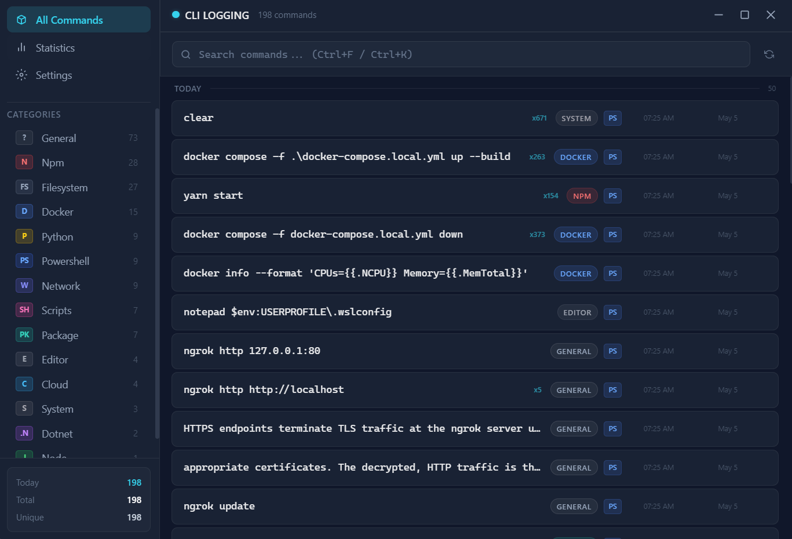
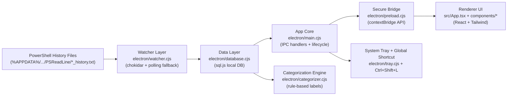

# CLI Logging - Windows CLI Command Tracking & Logging

<div align="center">


A local-first desktop app for command tracking, CLI logging, and PowerShell/CMD history insights on Windows.

</div>

---

## Overview: CLI Tracking, Command Logging, and History Insights

CLI Logging helps developers understand terminal usage patterns without sending data to external services.

It watches local PowerShell history files, categorizes commands automatically, stores everything locally, and gives you a modern UI for search + insights.

## Screenshot



## Key Features for Command Tracking and CLI Logging

- Live command ingestion from PowerShell history files
- Fast local storage with SQLite (`sql.js`)
- Automatic command categorization (Git, Docker, npm, Python, filesystem, cloud, and more)
- Instant search and category filters
- Stats dashboard with:
  - total commands
  - today activity
  - unique commands
  - category distribution
  - top repeated commands
  - hourly activity graph
- System tray integration + quick reopen
- Global toggle shortcut: `Ctrl + Shift + L`
- Clean frameless desktop experience

## How It Works: PowerShell/CMD Command Tracking Pipeline

1. The app watches PowerShell history files under `%APPDATA%`.
2. New command lines are captured in near real time.
3. Each command is categorized using rule-based matching.
4. Commands are stored in a local DB with timestamp, source, category, and frequency.
5. React UI fetches this data via secure Electron IPC and renders command views + analytics.

## Architecture: Desktop Command Logger Design



### Runtime Flow

1. `watcher.cjs` detects new terminal history lines.
2. `database.cjs` stores normalized command records locally.
3. `categorizer.cjs` assigns category labels (Git, Docker, npm, etc.).
4. `main.cjs` exposes command/stat APIs through IPC handlers.
5. `preload.cjs` safely bridges APIs into the renderer.
6. React UI renders command feed, filters, and analytics in real time.

## Tech Stack

- Electron
- React 18 + TypeScript
- Vite
- Tailwind CSS
- `sql.js`
- `chokidar`

## Getting Started

### Prerequisites

- Windows 10/11
- Node.js 18+
- npm

### Install & Run

```bash
npm install
npm run dev
```

This starts Vite + Electron in development mode.

### Build Installer

```bash
npm run build
```

Installer output is generated in `release/`.

## Project Structure: Source Layout for CLI Logging

```text
cli-logging/
|-- electron/
|   |-- main.cjs             # Electron app lifecycle, window, IPC, shortcuts
|   |-- preload.cjs          # Secure API surface for renderer (contextBridge)
|   |-- database.cjs         # Local DB init, CRUD, stats, history import
|   |-- watcher.cjs          # File watching for PowerShell history updates
|   |-- categorizer.cjs      # Command-to-category matching rules
|   `-- tray.cjs             # System tray menu + quick app controls
|-- src/
|   |-- App.tsx              # Main shell and view routing (home/stats/settings)
|   |-- components/
|   |   |-- Sidebar.tsx      # Navigation + category filters + quick counters
|   |   |-- SearchBar.tsx    # Search, shortcuts, category chips
|   |   |-- CommandList.tsx  # Grouped command timeline + virtualized loading
|   |   |-- CommandCard.tsx  # Individual command row UI
|   |   |-- StatsPanel.tsx   # Charts and usage analytics
|   |   `-- SettingsPanel.tsx# Import/clear actions + preference UI
|   |-- types/
|   |   `-- index.ts         # Shared command/stats/API TypeScript contracts
|   |-- main.tsx             # React entry point
|   `-- index.css            # Tailwind + theme styling
|-- public/                  # Static assets
|-- assets/                  # README/demo assets
|-- electron-builder.yml     # Windows packaging config
|-- tailwind.config.js       # Tailwind theme + tokens
|-- vite.config.ts           # Vite build/dev config
`-- package.json             # Scripts and dependencies
```

### Module Responsibilities

- `electron/*` handles ingestion, persistence, and desktop runtime features.
- `src/*` handles presentation, interaction, and analytics views.
- `assets/*` powers visual documentation for open-source readers.

## Privacy

- Local-first by design.
- No telemetry enabled by default.
- Command history data stays on your machine.

## Current Scope

- Primary focus: Windows + PowerShell history workflow.
- Some settings UI controls are currently presentational and can be wired deeper in future releases.

## Roadmap

- Persistent settings behavior (auto-start, watcher toggles)
- Better multi-shell source detection
- Export/import workflows
- Optional sensitive-command redaction
- Extended analytics and trend insights

## Contributing

Contributions are welcome.

1. Fork the repo
2. Create a feature branch
3. Commit with clear messages
4. Open a pull request

## License

This project is licensed under the MIT License. See the [LICENSE](LICENSE) file for details.
